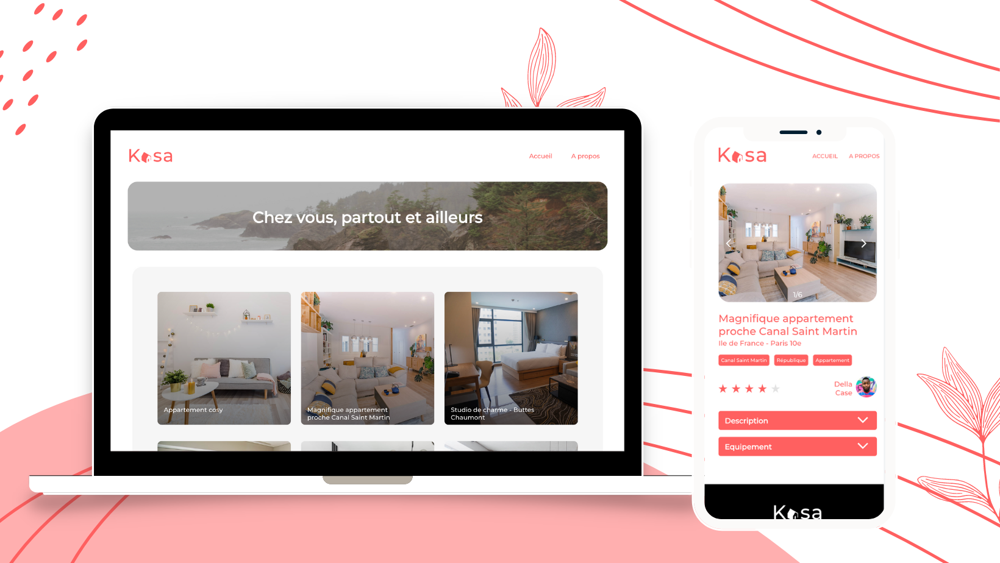

# Kasa Project

## Description
This project is the 11th project of the OpenClassrooms of the Front-End path. The goal was to create a website for a company that rents houses and apartments. The website must be responsive and accessible to all. The website must be composed of 3 pages: a homepage, a page presenting the different accommodations and a page presenting the company.

## Installation
Clone this repository. From within the project folder, run `npm install`. You can then run the project with `npm start`. You can access the website at `localhost:3000`.

## Technologies
* Create React App
* React Router

Visual Studio Code was used as IDE for this project.

